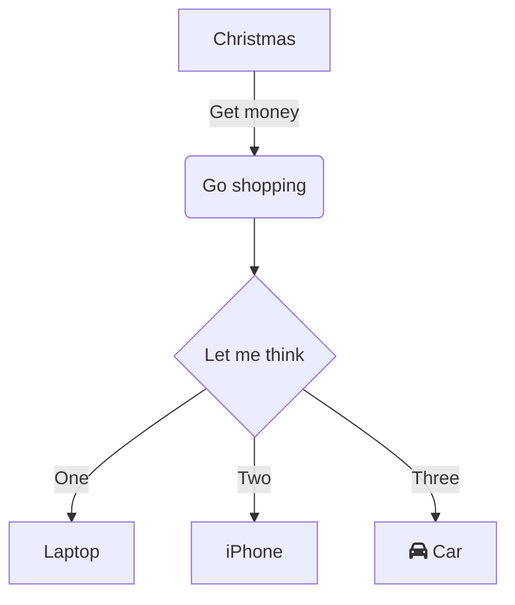

1. Connect to system db with a super user
1. Gather migration files
1. List all existing database
1. Extract database who needs to be created
1. Create database
1. Per database
1.

# Migration file

```yaml v1.0.0-initialize.yml
database: { dbName }

create:
  collection:
    - name: { collectionName }
  edgeCollection:
    - name: { edgeCollectionName }

delete:
  collection:
    - name: { collectionName }
  edgeCollection:
    - name: { collectionName }
```

This migration file will do:

- create database if not exist
- create a collection and an edge
- delete a collection and an edge

# Delete option

By default migration delete switch name of the collection with a prefix or something to defined, if you pass cleanNow option it will be directly deleted but it's dangerous.
We recommand to not use this options and manually clean up with our command `arangomigration cleanup` who will list all deleted collection and edges order by old first.

Note: it will be intersting to take deletion by time and add some critic levels to know if it is safe to be deleted. These levels can be change in .arangomigrationrc

# Revert a migration

when you revert a migration it will switch create section into delete section

`arangomigration migrate -f ./dossier`
